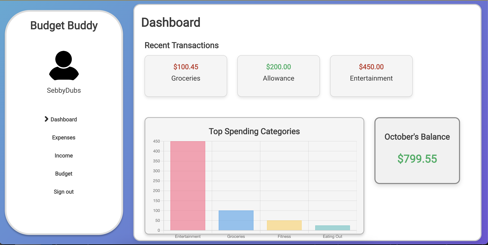
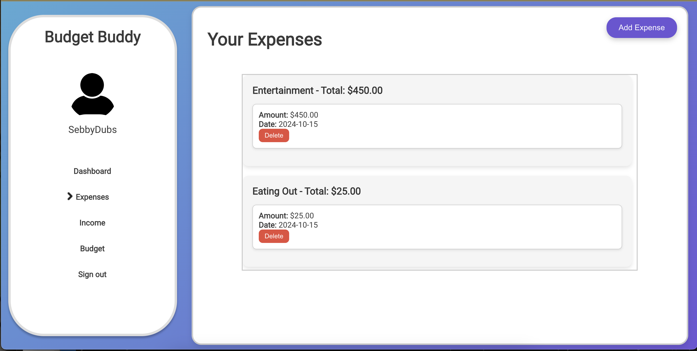

# Budget Buddy

**Budget Buddy** is a full-stack personal finance management application that helps users track their income, expenses, savings goals, and budgets. The app also provides streaks for positive financial behavior, including daily login streaks, positive monthly balance streaks, and monthly budget streaks.

## Features

- **Expense Tracking**: Log and categorize your expenses.
- **Income Tracking**: Record and manage your income sources.
- **Budget Management**: Set monthly budgets for different categories and track your progress.
- **Savings Goals**: Create savings goals, track progress, and visualize the progress toward your financial targets.
- **Positive Streaks (In Development)**:
  - Daily login streak.
  - Positive monthly balance streak.
  - Monthly budget streak for staying within your budget.
- **Toast Notifications**: Users get notified with toasts when they are close to or exceeding their budget.
- **Streak Notifications**: Toast notifications on login to celebrate streak achievements.
- **Responsive Design**: Mobile-friendly UI.
  
## Technologies Used

### Backend
- **Flask**: A lightweight WSGI web application framework in Python.
- **Flask-JWT-Extended**: Handles user authentication via JSON Web Tokens.
- **SQLAlchemy**: A SQL toolkit and Object-Relational Mapping (ORM) library for the backend.
- **SQLite**: For database management.
- **Flask-Migrate**: For handling database migrations.

### Frontend
- **React**: A JavaScript library for building user interfaces.
- **React Router**: For handling routing in the app.
- **Axios**: For making API requests to the Flask backend.
- **React-Toastify**: For showing toast notifications.
- **CSS Modules**: For styling the React components.
  
## Installation and Setup

### Prerequisites

- Node.js and npm
- Python (>=3.8)
- Flask
- SQLite

### Backend Setup

1. Clone the repository:
    ```bash
    git clone https://github.com/your-username/budget-buddy.git
    cd budget-buddy/backend
    ```

2. Create a virtual environment:
    ```bash
    python3 -m venv venv
    source venv/bin/activate  # On Windows use `venv\Scripts\activate`
    ```

3. Install the Python dependencies:
    ```bash
    pip install -r requirements.txt
    ```

4. Initialize the database:
    ```bash
    flask db init
    flask db migrate -m "Initial migration"
    flask db upgrade
    ```

5. Run the Flask server:
    ```bash
    flask run
    ```

### Frontend Setup

1. Navigate to the frontend directory:
    ```bash
    cd ../frontend
    ```

2. Install npm dependencies:
    ```bash
    npm install
    ```

3. Start the React development server:
    ```bash
    npm start
    ```

The React app will start on `http://localhost:3000`, and the Flask backend will run on `http://localhost:5000`.

## API Endpoints

### Authentication
- **POST /auth/register**: Register a new user.
- **POST /auth/login**: Login with email and password. Returns a JWT token.

### Expenses
- **POST /budget/expenses**: Add a new expense.
- **GET /budget/expenses**: Get all expenses.
- **DELETE /budget/expenses/:id**: Delete an expense by ID.

### Income
- **POST /budget/income**: Add a new income.
- **GET /budget/income**: Get all income records.
- **DELETE /budget/income/:id**: Delete an income record by ID.

### Budget
- **POST /budget**: Set or update a budget for a category in a particular month.
- **GET /budget/budgets**: Get all budgets for the authenticated user.

### Streaks
- **GET /auth/streaks**: Get the user's login streak and budget streak.

## Future Improvements

- **AI-Powered Categorization**: Automatically categorize expenses based on transaction descriptions.
- **Spending Challenges**: Create community-driven spending challenges.
- **Achievements & Badges**: Reward users with badges for completing certain financial behaviors.

## Screenshots

### Dashboard


### Expense List


## License

This project is licensed under the MIT License - see the [LICENSE](LICENSE) file for details.
